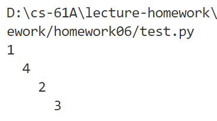

# Homework 06

## Midsemester Survey

### Q1: Survey

不是 UCB 的学生捏。。


## OOP

### Q2: Vending Machine

```shell
python ok -q VendingMachine --local
```

根据示例完成 Vending Machine 对象（储蓄型购物机

- `init("good name", price)`：声明一种商品和相应价格
- `vend`：完成售卖行为
  - 刚好花完：`'Here is your candy.'` 
  - 需要还钱：`'Here is your [good] and $[rest] change.'` 
- `add_funds`：用户放入购买商品的金额
  - 如果数量不足 `'Inventory empty. Restocking required. Here is your $15.'` 全额返回
  - 如果金额不足 `'You must add $[num] more funds.'` 是至少一件的购买价格
- `restock` ：为已经存在的商品指定数量
  - 未指定：` 'Inventory empty. Restocking required.'` 
  - 指定后：`'Current [good] stock: [nunm]'`

逆天，吐了，无语，边看错误报告边改分支

终于过了，真无语


### Q3: Mint

```shell
python ok -q Mint --local
```

完成铸币厂和硬币的实例，给硬币赋能×


## Trees

### Q4: Is BST

```shell
python ok -q is_bst --local
```

判断二叉搜索树，每个结点最多有两个分支，并且满足 `left < mid < right` 的大小关系

题目提示需要考虑有单个分支的情况，虽然这种情况该分支上的结点值可大可小

也提示需要写两个子函数，辅助判断 `bin_min` 和 `bin_max` 

每遇到一个非叶节点，都要开启两个递归，判断是否满足大小条件，如果只有一个分支，应该以下一层结点与当前结点的大小关系为依据向下递归，直到全部完成，返回 True 否则 False


既需要递归的 True / False 返回结果，也需要下一层的结点值，所以考虑用两个返回值

```python
def is_bst(t):
    "*** YOUR CODE HERE ***"
    def bin_max(t):
        if t.is_leaf():
            return t.label
        return (bin_max(t.branches[0]) <= t.label) and (bin_min(t.branches[1]) >= t.label)
    
    def bin_min(t):
        if t.is_leaf():
            return t.label
        return (bin_max(t.branches[0]) <= t.label) and (bin_min(t.branches[1]) >= t.label)
    
    if t.is_leaf():
        return True
    
    elif len(t.branches) == 2:
        return (bin_max(t.branches[0]) <= t.label) and (bin_min(t.branches[1]) >= t.label)
    
    else:
        if t.branches.label > t.label:
            # 逐渐增长
            return bin_min(t.branches) > t.label
        else:
            # 逐渐减少
            return bin_max(t.branches) < t.label
```


说实话，改成两个返回值之后这个递归我自己都看不懂

```python
def is_bst(t):
    """Returns True if the Tree t has the structure of a valid BST.

    >>> 
    >>> is_bst(t4)
    True
    >>> t5 = Tree(1, [Tree(0, [Tree(-1, [Tree(-2)])])])
    >>> is_bst(t5)
    True
    >>> t6 = Tree(1, [Tree(4, [Tree(2, [Tree(3)])])])
    >>> is_bst(t6)
    True
    >>> t7 = Tree(2, [Tree(1, [Tree(5)]), Tree(4)])
    >>> is_bst(t7)
    False
    """
    "*** YOUR CODE HERE ***"
    def bin_max(t):
        if t.is_leaf():
            return True, t.label
        if bin_max(t.branches[0])[0] and bin_min(t.branches[1])[0]:
            return (bin_max(t.branches[0])[1] <= t.label) and (bin_min(t.branches[1])[1] >= t.label), t.label
        else:
            return False
    
    def bin_min(t):
        if t.is_leaf():
            return True, t.label
        if bin_max(t.branches[0])[0] and bin_min(t.branches[1])[0]:
            return (bin_max(t.branches[0])[1] <= t.label) and (bin_min(t.branches[1])[1] >= t.label), t.label
        else:
            return False
    
    if t.is_leaf():
        return True
    
    elif len(t.branches) == 2:
        if bin_max(t.branches[0])[0] and bin_min(t.branches[1])[0]:
            return (bin_max(t.branches[0])[1] <= t.label) and (bin_min(t.branches[1])[1] >= t.label)
        else:
            return False
    
    else:
        if t.branches[0].label > t.label:
            # 逐渐增长
            if bin_min(t.branches[0])[0]:
                return bin_min(t.branches) >= t.label
            else:
                return False
        else:
            # 逐渐减少
            if bin_max(t.branches[0])[0]:
                return bin_max(t.branches) <= t.label
            else:
                return False

# 有一说一 改到现在问题在 t4 的例子 没有对纯单叉树进行讨论 虽然肯定能改出来 (无非就是再多一套 if-else
# 但是! 我觉得应该不至于这么做
# 还是先改出来吧 很丑陋就是了
# yue 这样铁定不对
```


我要吐了，从 t1 改到 t7 但是这个 t6 真的不是答案出问题了吗 这怎么可能是二叉搜索树呢

```python
def is_bst(t):
    def bin_max(t):
        if t.is_leaf():
            return True, t.label
        if len(t.branches) == 2:
            if bin_max(t.branches[0])[0] and bin_min(t.branches[1])[0]:
                return (bin_max(t.branches[0])[1] <= t.label) and (bin_min(t.branches[1])[1] >= t.label), t.label
            else:
                return False, t.label
        else:
            # 已经进入应该只考虑单方向 -> 逐渐减少的情况
            if bin_max(t.branches[0])[0]:
                return bin_max(t.branches[0])[1] <= t.label, t.label
            else:
                return False, t.label
    
    def bin_min(t):
        if t.is_leaf():
            return True, t.label
        if len(t.branches) == 2:
            if bin_max(t.branches[0])[0] and bin_min(t.branches[1])[0]:
                return (bin_max(t.branches[0])[1] <= t.label) and (bin_min(t.branches[1])[1] >= t.label), t.label
            else:
                return False, t.label
        else:
            if bin_min(t.branches[0])[0]:
                return bin_min(t.branches[0])[1] >= t.label, t.label
            else:
                return False, t.label
    
    if t.is_leaf():
        return True
    
    elif len(t.branches) == 2:
        if bin_max(t.branches[0])[0] and bin_min(t.branches[1])[0]:
            return (bin_max(t.branches[0])[1] <= t.label) and (bin_min(t.branches[1])[1] >= t.label)
        else:
            return False
    
    else:
        if t.branches[0].label > t.label:
            # 逐渐增长
            if bin_min(t.branches[0])[0]:   # Error: 'bool' object is not subscriptable
                return bin_min(t.branches[0])[1] >= t.label
            else:
                return False
        else:
            # 逐渐减少
            if bin_max(t.branches[0])[0]:
                return bin_max(t.branches[0])[1] <= t.label
            else:
                return False
```



这怎么可能是二叉搜索树，不管了，我认为我过了😎，我坚决认为 t6 的答案给错了


## Linked Lists

### Q5: Store Digits

```shell
python ok -q store_digits --local
```

如果能反转的话就很好办了，但是题目禁止了 emmm.... (⌐■_■)

想不到特别好的方法，有个想法就是先用一个函数去计算这个数值的位数，然后用位数去循环，每次减去最高位，不然每次从末尾取值然后添加违背了递归规律，那样是肯定做不了的

即使通过乱七八糟的手段把数值拆成数字放在列表中，也是要靠递归去构建 `Link()` 的，除非设置为 `Nonlocal` 的状态，emm... 做肯定是能做，但是😶‍🌫️

简单的看了一下后面的题，我感觉我也都做不出来了哈哈哈😎😭


返回函数，在返回的函数中声明实例，嗯，确实是我想不到的 :)

```python
def store_digits(n):
    def helper(lst, n):
        if n == 0:
            return lst
        lst = Link(n % 10, lst)		# 核心: 每次选取的最末尾元素添加到 Link.rest
        return helper(lst, n//10)
    ans = Link(n%10, Link.empty)
    return helper(ans, n//10)
```

这里的实现方式就是逆着方向完成了递归，没想到居然真的能做到，看着答案很容易，但是这个思路真的很巧妙啊


## Generators/Trees

### Q6: Yield Paths

```shell
python ok -q path_yielder --local
```

要求找到找到一棵树从根节点到某个值（结点值不唯一）的所有路径

题目提示说在不考虑使用 yield 关键字的情况下想一想该如何实现

（用循环 + 递归表示这个过程太复杂.. 嗯，总之我想的就是对 lst 进行 `append()` 和 `pop()` 操作

使用 generator 相对于递归，特殊点就在于及时返回结果保存状态（从这个角度确实应该用生成器

就是遍历整棵树，如果找到了特定值，直接通过 yield 返回，然后继续遍历（在 t2 的举例中也能说明这点


我目前没有想明白第二个循环该干什么，所以我首先是这么写

```python
def path_yielder(t, value):
    "*** YOUR CODE HERE ***"
    if t.label == value:
        yield [t.label]
    for branch in t.branches:
        "*** YOUR CODE HERE ***"
        yield [t.label] + path_yielder(branch,value)   # Error: path_yielder is generator

# 理所当然的出错了
```

虽是如此，第二个循环该写什么我还是不知

```python
def path_yielder(t, value):
    "*** YOUR CODE HERE ***"
    if t.label == value:
        yield [value]
    for b in t.branches:
        for path in path_yielder(b, value):
            # emm.. 思路上问题不大 就是需要拆出一个循环用于类型处理
            yield [t.label] + path
```

啊啊啊啊啊啊啊啊啊啊啊啊，我明明那么接近了啊啊啊啊啊啊啊啊啊啊啊啊，不要把函数的递归调用写在 yield 中

至于为什么要写成循环，从理论上来说，这个 path 只有一个元素，只是 path_yielder() 返回生成器只能通过 `for-loop` 才能正确的把里面的内容取出来

```python
def path_yielder(t, value):
    "*** YOUR CODE HERE ***"
    if t.label == value:
        yield [value]
    for b in t.branches:
        path = path_yielder(b, value)	# Error: TypeError
        yield [t.label] + path
```


# Optional Questions

### Q7: Remove All

```shell
python ok -q remove_all --local
```

在原链表的基础上修改，

同样还是两个一组去修改，但是要考虑递归不能返回任何直接结果

### Q8: Deep Map

```

```

