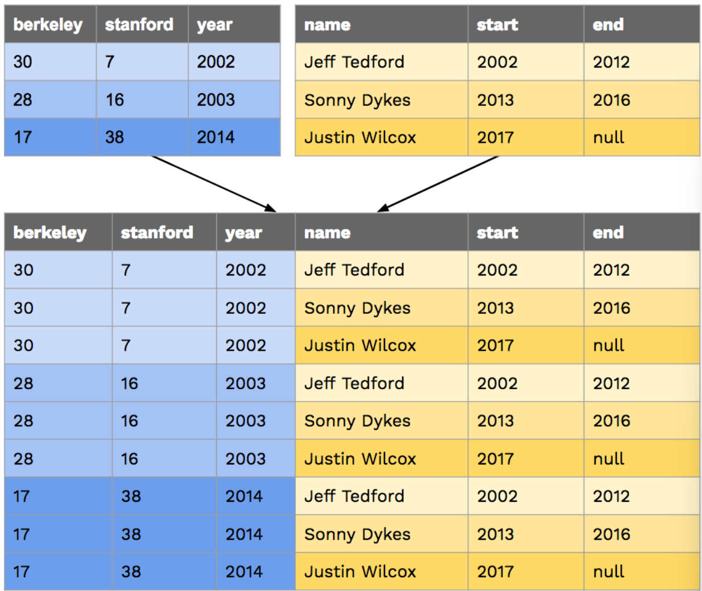

# Lab 13: SQL

#### Trouble Shooting

在 Lab 13 的文件中提供了教授自己编写的一个简易 `sql_shell` 交互界面，调用 `Python buildin SQLite` 引擎处理

这里主要介绍数据库的官网安装（我已经装过了，而且课程提供的 shell 可以运行，就无所谓了

```shell
sqlite3 --version
```


#### SQL Basic

##### Creating Tables

```sqlite
CREATE TABLE [table_name] AS 
	SELECT [val1] AS [column1], [val2] AS [column2], ... UNION
	SELECT [val2]			  , [val4]			   , ... UNION
	SELECT [val5]			  , [val6]			   , ...;
	
CREATE TABLE my_table AS 
	SELECT 30 AS berkeley, 7 AS stanford, 2002 AS year UNION
	SELECT 28			 , 16			, 2003 		   UNION
	SELECT 17			 , 38			, 2014;
```

| berkeley | stanford | year |
| -------- | -------- | ---- |
| 30       | 7        | 2002 |
| 28       | 16       | 2003 |
| 17       | 38       | 2014 |


##### Selecting Tables

更一般的情况下，是通过从已经存在的数据表中取出特定的数据

```sqlite
SELECT [columns] FROM [tables] WHERE [condition] ORDER BY [columns] LIMIT [limit];
```

- SELECT[columns]：表示从已存在的 table 中选取哪些列作为输出，逗号或者 `*` 可以选取多列
- FROM[table]：选取表，也可以通过 `JOIN` 选取多个表
- WHERE[condition]：对选取结果进行筛选
- ORDER BY [columns]：输出结果按照某种特定方式排序
- LIMIT [limit]：通过整数 `limit` 限制输出表的行数展示

Tip：SQL 语句不区分大小写的，只不过大写是传统就是了

```sqlite
SELECT berkeley FROM big_game WHERE year > 2000;
```


#### SQL Operation

适配 `Python operator expr` 没啥好说明的

```sqlite
-- concatenation operator:	||

SELECT "hello" || " " || "world"
```


#### SQL Join

表的合并，这个对关联型数据库算是至关重要了（ `inner join` ），对两个表进行笛卡尔积

笛卡尔积：A 表的每一个元素都会对应一整张 B 表



可以选取多个不同的表，也可以从一个相同的表中选取多次

```sqlite
SELECT * FROM big_game, coaches WHERE year >= start AND year <= end;
17|38|2014| Sonny Dykes|2013|2016
28|16|2003|Jeff Tedford|2002|2012
30| 7|2002|Jeff Tedford|2002|2012
```

注意，两张表中可能有重名列的情况，这个时候一定要对名称进行区别，使用 `AS` 进行重命名之类的

```sqlite
SELECT b.Berkeley - a.Berkeley,
	   b.Stanford - a.Stanford,
	   a.Year,
	   b.Year 
FROM big_game AS a,
	 big_game AS b
	 WHERE a.Year < b.Year;
```

只不过这种 `inner join` 的方式对资源的消耗比较大


### The Survey Data!

对本次作业使用的数据集的介绍

| Column Name  | Question                                                     |
| ------------ | :----------------------------------------------------------- |
| `time`       | The unique timestamp that identifies the submission          |
| `number`     | What's your favorite number between 1 and 100?               |
| `color`      | What is your favorite color?                                 |
| `seven`      | Choose the number 7 below. Options: 7Choose this option insteadseventhe number 7 below.I find this question condescending |
| `song`       | If you could listen to only one of these songs for the rest of your life, which would it be? Options: "Never Be Like You" by Flume"Truth Hurts" by Lizzo"Clair de Lune" by Claude Debussy"Rock and Roll all Nite" by Kiss"Dancing Queen" by ABBA"So What" by Miles Davis"Down With The Sickness" by Disturbed"Seasons of Love" from Rent"Formation" by Beyonce |
| `date`       | Pick a day of the year!                                      |
| `pet`        | If you could have any animal in the world as a pet, what would it be? |
| `instructor` | Choose your favorite photo of John DeNero (Options shown under Question 3) |
| `smallest`   | Try to guess the smallest unique positive INTEGER that anyone will put! |

有人对 pet 选 capybara，而且还是两个，被我注意到了

还有一个 `"myself xd"` 绝对是中国人吧超

- `numbers`: The results from the survey in which students could select more than one option from the numbers listed, which ranged from 0 to 10 and included 2018, 9000, and 9001. Each row has a time (which is again a unique identifier) and has the value `'True'` if the student selected the column or `'False'` if the student did not. The column names in this table are the following strings, referring to each possible number: `'0'`, `'1'`, `'2'`, `'4'`, `'5'`, `'6'`, `'7'`, `'8'`, `'9'`, `'10'`, `'2018'`, `'9000'`, `'9001'`.

### Q1: What Would SQL print?

```shell
python sqlite_shell.py --init lab13.sql
```

```sqlite
-- before start, inspect the schema of the table
.schema
-- tells the name of each of our tables and their attributes

CREATE TABLE students(
  time,
  number,
  color,
  seven,
  song,
  date,
  pet,
  instructor,
  smallest
);
CREATE TABLE numbers(
  time,
  "0",
  "1",
  "2",
  "3",
  "4",
  "5",
  "6",
  "7",
  "8",
  "9",
  "10",
  "2019",
  "9000",
  "9001"
);
CREATE TABLE bluedog(
  """REPLACE THIS LINE WITH YOUR SOLUTION"""
);
CREATE TABLE bluedog_songs(
  """REPLACE THIS LINE WITH YOUR SOLUTION"""
);
CREATE TABLE matchmaker(
  """REPLACE THIS LINE WITH YOUR SOLUTION"""
);
CREATE TABLE sevens(
  """REPLACE THIS LINE WITH YOUR SOLUTION"""
);
CREATE TABLE favpets(
  """REPLACE THIS LINE WITH YOUR SOLUTION"""
);
CREATE TABLE dog(
  """REPLACE THIS LINE WITH YOUR SOLUTION"""
);
CREATE TABLE bluedog_agg(
  """REPLACE THIS LINE WITH YOUR SOLUTION"""
);
CREATE TABLE instructor_obedience(
  """REPLACE THIS LINE WITH YOUR SOLUTION"""
);
```

这个就是查看一下，并没有要写的

注意后续每次完成一个问题，都要重新输入初始化命令否则不识别


### Q2: Go Bears! (And Dogs?)

```shell
python ok -q bluedog --local
```

#### bluedog

写一个查询，包含 `color` 和 `pet`，限制 `color = blue` 并且 `pet = dog` 

```sqlite
SELECT * FROM bluedog;
```

#### bluedog_songs

只能显示该结果的数量，但是不能反映用户的情况，现在要在结果上附加 `song` 属性

```sqlite
SELECT * FROM bluedog_songs;
```


### Q3: Matchmaker, Matchmaker

```shell
python ok -q matchmaker --local
```

根据爱好进行匹配，根据音乐倾向和宠物匹配，因为是在同一个表中找匹配，所以需要对 `student` 自身 `join` 

可以使用 `table_name.column_name` 来对属性进行区分

```sqlite
SELECT <[alias1].[column name1],
		[alias2].[columnname2]>
FROM <[table_name1] AS [alias1],
	  [table_name2] AS [alias2]>
```

要求返回的 `table` 包含 4 个属性：

- 共同喜欢的宠物
- 共同喜欢的歌曲
- 第一个人最喜欢的颜色
- 第二个人最喜欢的颜色

```sqlite
-- Wrong Answer
CREATE TABLE matchmaker AS
  SELECT
  stu_A.pet, stu_A.song, stu_A.color, stu_B.color 
  FROM
  students stu_A INNER JOIN students stu_B 
  WHERE stu_A.pet = stu_B.pet AND stu_A.song = stu_B.song AND stu_A.time != stu_B.time
  ORDER BY stu_A.time;

-- Correct Answer
CREATE TABLE matchmaker AS
  SELECT
  stu_A.pet, stu_A.song, stu_A.color, stu_B.color 
  FROM
  students stu_A INNER JOIN students stu_B 
  WHERE stu_A.pet = stu_B.pet AND stu_A.song = stu_B.song AND stu_A.time < stu_B.time
  ORDER BY stu_A.time;
  
-- 区别就在 stu.time 的判断 我认为不相等就可以了(排除自己) 但是答案必须要小于才行 我不太理解...
```

其实是 `Inner Join` 的结构问题，每一条 `stu_A` 数据都对应着一个 `stu_B` 表，在判断当前的该条 `stu_A.row` 的时候，时间在 `row.time` 之前的数据都已经被判断过了，所以要求**严格小于** 

对第 k 条数据，只能在 B 表的 `[1 - (k - 1)]` 的范围内进行匹配，最后一条和前面所有数据匹配

（即使当前的数据匹配发生在后面，会在后面的过程匹配到，不会影响到结果，如果是 `!=` 的比较，**会重复匹配** 

```shell
#     turtle|Dancing Queen|blue|blue
#     turtle|Dancing Queen|blue|purple
#     dog|Clair De Lune|blue|red
#     dog|Clair De Lune|blue|green
#     dog|Clair De Lune|blue|blue
#     dog|Formation|blue|blue
#     dog|Formation|blue|blue
#     fox|Truth Hurts|blue|black
#     turtle|Dancing Queen|blue|blue
#     turtle|Dancing Queen|blue|purple

# 这里的 turtle 其实就发生了重复匹配的问题
```


### Q4: Sevens

```shell
python ok -q sevens --local
```

数据库的两个表 `students` 和 `number` 时间是共同属性，查看哪些学生在 `number table` 中选了 7 并且喜欢 7

返回一个只包含 `students.seven` 的表


### Q5: Let's Count

```shell
python ok -q lets-count --local
```

#### SQL Aggregation

对查询结果进行分组和统计（最大值，最小值，个数，平均值之类的）

```sqlite
SELECT number, COUNT(*) AS count FROM students GROUP BY number ORDER BY count;
```


# Done!

SQL 蛮简单的，毕竟之前就学过，就是注意一下 `Inner Join` 的匹配关系