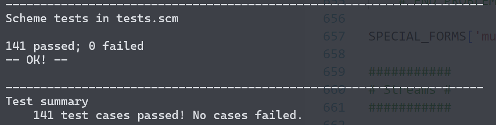

# Special Forms

实现一些 SPECIAL FORM 的逻辑功能，之所以特殊呢，是因为涉及到相关的子表达式并不是都需要计算

**重点：**只有 `#f` 才算 False，框架提供了 `is_true_primitive()` 和 `is_false_primitive()` 函数判断

题目要求先看懂 `do_if_form()` 方法


### Problem 12

```shell
python ok -q 12 -u --local
```

条件表达式要求 `short-circuiting`，即只执行必要运算，所以从左到右遍历所有子表达式，遇到 `#f` 直接返回

（如果在 `and-expr` 中没有 `last sub-expr` 那么直接返回 `#t` ）

对每个子表达式调用 `scheme_eval()` 计算

```scheme
(not (and #t #f 42 (/ 1 0)))
; #t

(or)
; #f

(or (+ 1 1))
; 2

(define (zero) 0)
(or (zero) 3)
; # 0
```


明明是两个函数的内容但是只给一分真过分啊	(￣へ￣)

```shell
python ok -q 12 --local
```


### Problem 13

```shell
python ok -q 13 -u --local
```

```python
from scheme import *

env = create_global_frame()

# 同样是删掉了 cond 关键字但是保留了 Pair 结构
expr = read_line("(((= 4 3) 'wat) ((= 4 4)) (else 'hm))")

print(do_cond_form(expr, env))
```

实现 `cond` 分支控制，和判断语句不同，这里是返回第一个判断值为真的子表达式的结果，如果没有判断为真的语句，返回 `else-branch` 对应的子表达式的结果

```scheme
(cond (
       (= 4 3) 'wat)
       ((= 4 4) )
       (else 'hm)
)
```

- 如果判断值为真但是没有需要计算的子表达式，返回判断值
- 如果子表达式有多个，那么使用 `eval_all()` 方法返回最后一个运算式的值

- 如果没有判断为真并且也没有 `else-branch` 分支，那么返回 `None` 
- 如果只有 `else-branch` 分支，返回子表达式的运算结果，如果没有子表达式的话返回 `#t` 


```shell
python ok -q 13 --local
```


### Problem 14

```shell
python ok -q 14 -u --local
```

实现 `make_let_frame()` 功能，涉及变量的作用域问题，返回一个  `env` 的子函数帧，完成变量与表达式的绑定

`<symbol: a corresponding expr>` 注意是表达式哦

乱敲一通发现应该是我理解错了...	不需要考虑 `let_expr` 语句中的执行体部分，只需要考虑 `let_binding` 

所有我敲着敲着发现我自己的测试过程和题目过程有结构上的区别（对自己真是无语了

```scheme
(define x 5)
(define y 'bye)

; case1: 重点就是作用范围
(let (
      (x 42)
      (y (* x 10))	; x refers to the global value of x, not 42
      )
	(list x y)
)
; (42 50)

; case2: 重点是 let 程序的结构
(define x 1)
(let (
      (x 5)
     )
	(+ x 3)
)
; 8

(let (
      (x 5)
      )
    ; 内部的 let-expr 在 x = 5 的环境中运算
	(let (
          (x 2)	; x = 2
		  (y x)	; y = 5
         )
	(+ y (* x 2))
    )
)
; 9

(let ((a 2) (a 3)) (+ a a))
; SchemeError
```

- `validate_form()`：验证绑定结构的合法性，在上面的功能实现中也多次见到了
- `validate_formals()`：验证形参是合法的 `Scheme_List` 并且每个符号都是独立存在的
- `make_child_frame()`：我自己实现的，没啥好说的


又改了一通，目前是能处理最简单的 `let_expr` 但是没有办法处理嵌套的，看看有没有办法直接在 `scm` 中 debug

不过我觉得嵌套的 `let_expr` 理论上是不会有什么影响的，因为子表达式只是在父 `let_frame` 中再次调用而已

直接在 scheme.py 页面执行 Debug 就可以了，下面会有 `scm> ` 的提示，可以对输入 Debug


Q：现在找到问题了，还是对 `bindings` 的 Pair 结构不清楚，要怎么在不递归的情况下完成 `names` 的构造

（我甚至想过直接写一个 Python List 然后调用 `read_line()` 但是 `read_line()` 只能处理元组而不是列表

通过子函数重新构建 `names` 和 `values` 的 Pair 结构是可以的


没有必要正向构造，因为结构的问题很难处理，我这边在处理 3 个表达式的时候就报错了，因为 `names.first` 并没有包含第二个表达式，所以会造成变量丢失，实际上没有顺序要求，只要一一对应就行

```shell
python ok -q 14 --local
```

终于，MD 改了快两个小时


### Problem 15

```shell
python ok -q 15 -u --local
```

实现 scheme 中的动态变量范围

```scheme
(mu ([param] ...) <body> ...)
; Creates a new mu procedure with params as its params and the body expressions as body
; extend the current env instead create a new one

(define f (mu () (* a b)))
(define g (lambda () (define a 4) (define b 5) (f)))
(g)
; 20 使用的并不是函数的形参而是函数帧中的变量

(define y 1)
(define f (mu (x) (+ x y)))
; Pair(Pair('x', nil), Pair(Pair('+', Pair('x', Pair('y', nil))), nil))
(define g (lambda (x y) (f (+ x x))))
(g 3 7)
; 13
```

由于定义不同的父类函数帧，每次调用相同的函数 `f()` 都会返回不同的结果

Tip：这个特性不符合 scheme 标准，可能是出于对 LOGO 语言的考虑添加了这种特性

我没看明白题目想让我干什么(＠_＠;)	这是想让我写一个成员函数吗	我知道发生什么了，莫名其妙的，不知道为什么我代码里原来 `PROBLEM 15` 的地方变成了 `PROBLEM 18` 我还疑惑了好久

新定义的成员函数的命名：`make_call_frame()` 在 `line_64` 根据 `Procedure` 调用同名方法


目前 Debug 下来，环境是没问题的，但是计算过程出了问题，这个比较难办，不太确定是不是  `Q7` 出错了，但是 `Q7` 的测试又是没问题的，emm... 很奇怪啊

问题是 `eval_all(procedure.body, new_env)` 这里的调用 `body` 少了一层 `Pair` 结构

修改 `do_mu_form()` 就可以了，之前写的是 `body = expression.rest.first` 

```shell
python ok -q 15 --local
```

```shell
python ok -q tests.scm
```



呼哈哈哈哈，开心~


# Phase4 Pass!

开心hhhh，明天请假连着过五一，回母校找舍友咯ヾ(≧▽≦*)o