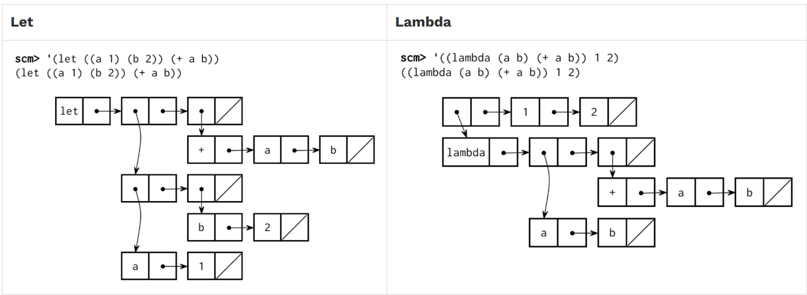

# Write Some Scheme

针对刚刚实现的解释器的测试并不算很完善，所以在自己的实现中可能有未发现的 bug，所以这阶段就是自己写一些 `Scheme Code`，先在 [61A Code (cs61a.org)](https://code.cs61a.org/) 运行成功后再去自己的解释器中运行


#### Scheme Editor

在编辑自己的 `Scheme Code` 的时候，可以通过 `Scheme Editor` 进行 `Debug` 操作

```shell
python editor

# localhost:31415
```

一定要新开一个 `powershell` 来执行 `python ok` 测试，否则会中止 `Scheme Editor` 的运行，如果发现你的代码可以运行在 `Scheme Editor` 但是在自己实现的解释器中不能，说明自己的实现的解释器中出了 bug，fix it


Tip：我最开始想着用网站测试就好，但是不行啊，很多 `Buildin Procedure` 没有，只能用 `Scheme Editor` 

╰（‵□′）╯


### Problem 16

```shell
python ok -q 16 --local
```

实现 `enumerate` 函数，接收一列值然后返回一个由 `()` 组成的列表

first element：the index of the value list

second element：the value itself

题目还提示了两个功能函数 `cons-all()` 和 `zip()` 用在 `enumerate()` 中，就是我没什么思路....

（简单看了看，发现后面的我好像都不太会啊... o.0		要不你直接杀了我这样更简单


我想不出来这个 `index` 的变量怎么处理，想出来了，写个子函数

```scheme
(define (enumerate s)
  (define (inner sub-index lst)
    
    (if (null? lst)
        nil
        (cons
         	(cons sub-index (cons (car lst) nil))
         	(cons (inner (+ 1 sub-index) (cdr lst)) nil)
        )
    )
  )
  (inner 0 s)
)

(enumerate '(1 2))

; ((0 1) ((1 2) ()))
; emm.. 结构上和答案要求的有根本上的不同 答案的 Pair 是平级的 但是我的实现是有层次的
; 我也想不太到了 emm...	去看看答案
```

```scheme
(define (enumerate s)
  ; BEGIN PROBLEM 16
  (define (helper s i ans)
      (if (null? s)
         ans
        (helper (cdr s) (+ i 1) (append ans (list (list i (car s)))))
      )
  )
  (helper s 0 nil)
)

; 没有意识到有个 append 方法 emm... 好气
; 在 Buildin 文件中还真的有 append() 方法 我不会要把这些函数全都看一遍吧我超 (‾◡◝)?

; (append [lst] ...)
(append '(1 2 3) '(4 5 6))
(1 2 3 4 5 6)

; 不过通过 ans 辅助变量来执行尾递归是我没想到的
; 答案写的真不错 结构清晰 好烦 我怎么写不出来
```

[Scheme Built-In Procedure Reference | CS 61A Summer 2020 (berkeley.edu)](https://inst.eecs.berkeley.edu/~cs61a/su20/articles/scheme-builtins.html) 很重要的参考

注意构造 `(index value)` 结构的时候，需要调用两次 `list()` 


### Problem 17

```shell
python ok -q 17 --local
```

就是那种很典型的，走台阶问题，这几道练习题我要 yue 了，我不会我真的不会啊呜呜呜呜呜呜

刚开始用 Python 写这类问题我就不太行，还指望我用 scheme 写... o(￣┰￣*)ゞ	不会不会，放弃

------

函数要求两个参数 `total` 和 `denoms` 

total：表示需要用零钱凑齐的目标数额

denoms：表示当前拥有的零钱的面额，每种面额的零钱数量无限

题目提示用 `BuildinProcudure Map()` 来实现辅助函数 `cons-all()`，把 `elem-first` 拼接到每个子列表首位

```scheme
(cons-all 1 
          '( (2 3) (4 5) (6 7) )
)

> ( (1 2 3)
    (1 4 5)
    (1 6 7)
   )
```

最后输出结果的时候提示用 `BuildinProceudre Append()` 输出

------

直接开始分析答案

首先是两种特殊情况的分析：

- total == 0：没有零钱需要找，直接返回空
- denoms == 0：没有零钱可以找，直接返回空

一般情况：

注意题目给出的零钱面额序列是有序的，所以可以依次分析，如果当前的零钱面额大于找钱面额，认为无效，去找下一个，否则，使用 `two path` 的递归思路，拆分成包含该零钱面额的组合 + 不包含该零钱面额的组合

```scheme
(define (cons-all first rests)
  (map
    (lambda (x)
      (append (list first) x)
    )
    rests
  )  
)

;; Problem 17
;; List all ways to make change for TOTAL with DENOMS
(define (list-change total denoms)
  ; BEGIN PROBLEM 17
  ; 首先处理特殊情况
  (if (eq? 0 total)
    (list nil)
    (if (null? denoms)
      ; 注意 denoms 是一个列表 判断方式会不太一样
      nil
      ; two path method
      (if (<= (car denoms) total)
        ; 当前的零钱面额可以用来找钱
        (append
          (cons-all (car denoms) (list-change (- total (car denoms)) denoms)) ; 针对当前元素可以兑换数额的遍历
          (list-change total (cdr denoms))  ; 剩余元素的遍历情况
        )
        ; 当前的面额不可以用来找钱
        ; 这里有个要求是 denoms 列表必须是降序排序
        (list-change total (cdr denoms))
      )
    )
  )
  ; END PROBLEM 17
)
```

虽然说是看答案了，但是和之前那几道相似的 Python 例题比起来强多了，这次的思路可以很清晰的顺下来，之前就是看答案都要折磨好久23333

（我估计我下一道题也做不出来就是了...


### Problem 18

```shell
python ok -q 18 -u --local
```

强调 scheme 中程序即数据的概念，实现类似于 `Python eval()` 的功能

题目举了个例子，把 `let function` 转化到 `lambda function` 去表示，得到相同结果，核心是新建一个函数帧

根据这一点，实现 `let-to-lambda` 功能，重写所有的 `let` 特殊形式，转换到 `lambda expr` （包括引号情况

因为 scheme expr 本身是递归的，所以转换也要递归表达

```scheme
(let-to-lambda 1)
; 1

(let-to-lambda '(+ 1 2))
; (+ 1 2)

(let-to-lambda '(lambda (x) (+ 1 x)))
; (lambda (x) (+ 1 x))

(let-to-lambda '(let ((a 1)) (let ((b a)) b)))
; ((lambda (a) ((lambda (b) b) a)) 1)
```


（题目提示说，其实就是用 scheme 去写一个 `scheme_eval()` ，不用考虑 `quasiquotation` 

辅助函数：使用 `BuildinProcedure Map()` 实现 `zip()`，把对应位置的元素拼成一个新列表


我觉得核心还是构造数据结构，只是在 scheme 里面，该数据结构碰巧为执行语句


Q：在执行测试语句 `(let-to-lambda '(+ 1 2))` 的时候不知道为什么没有进入 `quote branch` 反而进入 `else-branch` 

对于原子操作，比如变量或者数字直接返回 `expr` 就可以但是即使走对了分支，我也不知道该如何返回

尝试过 `(display expr)` 但是打印出来的是包含输入的完整语法，如果是 `(display (car expr))` 是 `+` 


MD，这个 Phase5 我近乎是放弃的状态，这个也是搞不定23333，只能说自己理解之后会默着写一遍

------


我先是看了看这个 zip 的实现，有点小小的局限性，只会对一列子列表的前两个元素进行处理，合并出只含有两个子列表的列表，无法对有 3 个元素的子列表起作用（应该是和 zip 在本题的作用范围有关

```scheme
(zip '((1 2 3) (4 5 6) (7 8 9)))
> ((1 4 7) (2 5 8))

(zip '((1 2) (3 4) (5 6)))
> ((1 3 5) (2 4 6))

; 结果只有两个子列表
```

题解给出的 zip 实现也挺巧妙的，使用 `tail recursion` 实现

emmm... 我没有理解题解的 `let-to-lambda()` 的分支判断，所以我觉得这道题的实现是有点问题的.......

> 不对，还是没问题的，我的锅，没有对 `lambda-branch` 进行跟踪×





注意观察 `let-expr` 的存储结构

```scheme
(car expr) = let
params = (car (cdr expr))	; ((a 1) (b 2))
body = (cdr (cdr expr))		; (+ a b)
; 这里就涉及到 zip 对两个参数的处理 得到 para-list 和 value-list
; 分别放入 lambda-expr 结构的对应位置
```


**Q：** `lambda expr` 的存储层次

```scheme
top: (list value)	(list 1 2)
list: (lambda params body)
params: (a (b nil))		body: (operator operands)

; 比较疑惑的是 lambda 字符外面要套两层 cons 我不理解 为什么
; 从表达式看 lambda 外层有两个括号 但是从存储结构看它又在第一层

(append
    (cons
      (cons
        'lambda 
        (cons formal (map let-to-lambda body))
      )
      nil
    )
    (map let-to-lambda value)	; return scheme list
)

; 同级之间可以用 cons 连接(也就是 lambda 那一串) 那到底是什么导致了存储层次的差异
; append 本身虽然是同级连接 本身不涉及 cons 构造 最外层的 cons 是为了容纳后面的 value

(append '(1 2 3) '(2 4))
; (1 2 3 2 4)

(append (cons 1 (cons 2 (cons 3 nil))) (cons 2 (cons 4 nil)))
; (1 2 3 2 4)

(append (cons (cons 1 (cons 2 (cons 3 nil))) nil) (cons 2 (cons 4 nil)))
; ((1 2 3) 2 4)
; append 会添加在 lst1 的末尾 nil 位置

; 所以我疑惑的不是本身的结构问题 而是 append() 的使用
```


**Q：**为什么 `lambda expr` 和 `define expr` 的语法定义不同但是可以使用相同的分支构造

核心就在于虽然形式看上去不同，但是结构是一样的，所以可以使用相同的构造方式

```scheme
(lambda (param)
	(body)
)

(define (func-name param)
	(body)
)
```


**Q：**在 Debug 的过程中出现了一个非常离谱的问题，那就是 scheme 的函数调用的问题，虽然我现在还不知道为什么，但是直接调用 `(caar lst)` 和 `(car (car lst))` 返回的列表结构不同

我马虎了，艹，没看清后面那个 second 是调用了三层，我的我的ㄟ( ▔, ▔ )ㄏ

```scheme
; zip
(helper
 	(cdr lst)
 	(append first (list (car (car lst))))
 	(append second (list (cdr (car lst))))
)

; ((lambda (a b) (+ a b)) (1) (2))
```

 

```shell
python ok -q 18 --local
```


# Phase5 Pass!

这，嗯... 也不好说是我自己写完的，虽然题是过了一遍，但是抄答案可能也不算写完2333

（不过总算是完成了嘛，虽然下一节我肯定也做不出来👾
